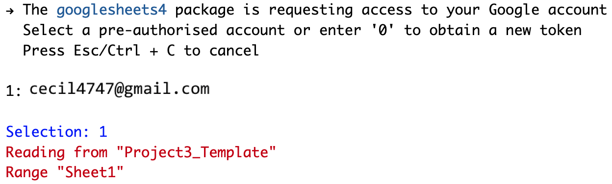

# Installing the package

Note that the code here **only needs to be run ONCE**. Once you have installed a package, you do not need to re-install it.

I recommend running these lines of code in the `Console` which always has the `>` symbol to take in a command).

```{r, eval=FALSE}
install.packages("googlesheets4")
```

You will see something like this - don't be alarmed by the red text!

```{r, echo=FALSE, out.height="780px"}
knitr::include_graphics("images/installationgunk.png")
```

# Setting up the `Googlesheets4` package

This workflow also only needs to be done **ONCE**. The first time you interact with a Google sheet using the `googlesheets4` Application Programming Interface (API) wrapper, it will ask you about permissions to store your credentials (account information). You can run these commands in the console.

The workflow is below:

1. Read in an example Google sheet, which will launch an initial query about what Google account you'd like to associate with the package:

```{r, eval=FALSE}
enviro_soc_media_DF <- googlesheets4::read_sheet("https://docs.google.com/spreadsheets/d/1hQy8kR81GHmMDPivpyd8XzAGU7A6oUCUArq1bltm5EQ/edit?usp=sharing")
```

2. At the same time, another tab will open in your internet browser on your computer, displaying a window that asks you to select which of your Google account(s) to grant access to in `RStudio Server` using the `googlesheets4` package.

```{r, echo=FALSE}
knitr::include_graphics("images/grantTidyverse.png")
```

3. Select `Allow`. Next, you will see:

```{r, echo=FALSE, out.height="700px"}
knitr::include_graphics("images/permissions.png")
```

4. Select `Allow` again. This will produce an authorization code that you will then copy and paste into your `RStudio` session. You can copy the code by pressing the `r fontawesome::fa("copy")` button to the right of the authentication code.

```{r, echo=FALSE}
knitr::include_graphics("images/RStudioOAuthCopyCode.png")
```

5. Next, navigate back to the internet browser tab running `RStudio Server`. You will paste the code in response to the `Enter authorization code` prompt waiting in the console.

```{r, echo=FALSE}
knitr::include_graphics("images/RStudioServerInitAuth.png")
```

6. Copy the authorization code into the blank space next to `Enter authorization code`.

7. Once you paste the code in, you will see this type of successful response, showing you that the authentication has worked and the `read_sheet` function `googlesheets4` will return:

```{r, echo=FALSE}
knitr::include_graphics("images/RStudioServerCopiedAuthKey.png")
```

8. Great work! You have successfully authenticated access to your Google account in your `RStudio Server` user workspace.

9. Going forward, even if you switch sessions, restart your session, or open a new session in XSEDE On Demand's `RStudio Server`, you shouldn't need to re-authenticate access to Google. Instead, your credentials will be stored in a cached file.

# Using `Googlesheets4` to interact with your Google sheets data

The code below can be copied into the text editor pane (top left hand side) and saved as an `R` script or `RMarkdown` file. If you haven't use `RMarkdown` before, I recommend using the `R` script format.

```{r, eval=FALSE}
library("googlesheets4") # load package into workspace
myDF <- googlesheets4::read_sheet("SHARING LINK - replace with your link",sheet=2) # change this as needed
```

To run this code, you will need to generate a sharing link for your Google sheet. You will also need to know which sheet you want to pull in. The default is the first tab (e.g. `sheet=1` above). You may get error messages - that is no problem. Post them to the appropriate Slack channel in the lab workspace. Most errors will arise with issues with how the data is formatted.

When you start a new RStudio session, the first time in that session that you use `Googlesheets4`, you may see this query:

```{r, echo=FALSE}

```

You can proceed by selecting `1` for the default account. Or if you'd like to use a different Google account, you can type in `0` then go through the steps to link a Google account that I describe above.

