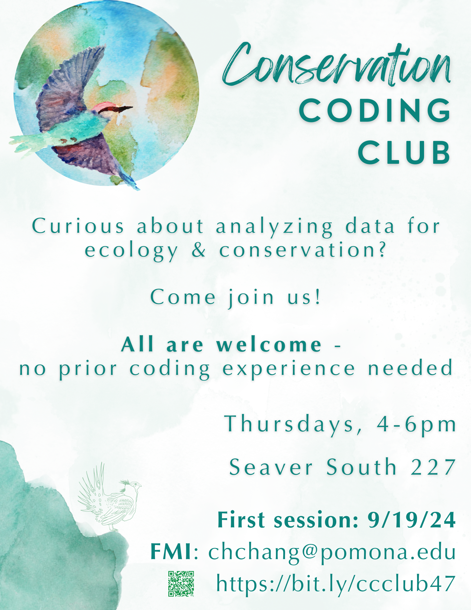

```{r setup, include=FALSE}
POMblue <- "#0057B7"
options(tinytex.verbose = TRUE)
```




# Conservation Coding Club

* [Thursday September 19, 2024: Deforestation](https://colab.research.google.com/drive/1Voqkwp3e_TuegQRVmEYva-0XPb4ff8Gt?usp=sharing)

# Resources to use Python

Please navigate to the [Python tutorials page](https://chang-consci-lab.github.io/labprojects/python-intro.html)

<!--
# Overview
This site contains information such as tutorials or links to documents for performing research in the CSSL / Chang Lab.

## XSEDE RStudio Server instructions

[You can find the documentation for logging into XSEDE and interacting with the resource here.](https://docs.google.com/document/d/1oJMRXiUP0GdzFxMk6LlD3iVpmUyVN5S6tUYIDbUvQE4/edit?usp=sharing)

In addition to the `googlesheets4` package, I recommend installing `readr`. In RStudio, you only need to run this command **once**: `install.packages("readr")`.
-->
